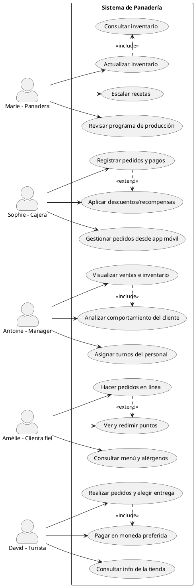

# Requerimientos: 

Actores claves en el sistema: 
Marie, la panadera
Sophie, la cajera
Antoine, el manager
Amélie, la clienta fiel
David, el turista

🔄 Interacciones y Casos de Uso por Actor
1. Marie, la panadera
Interacciones:
Interactúa con el sistema de inventario y gestión de recetas.
Consulta el programa de producción.
Casos de uso:
Consultar y actualizar inventario de ingredientes.
Escalar recetas según la cantidad a hornear.
Revisar el programa de producción diario y semanal.

---
2. Sophie, la cajera
Interacciones:
Opera el sistema de punto de venta (POS).
Usa la app para aplicar descuentos o fidelización.
Casos de uso:
Registrar pedidos y pagos de clientes.
Aplicar descuentos y recompensas.
Gestionar pedidos y revisar inventario desde app móvil.
---
3. Antoine, el Manager
Interacciones:
Administra datos operativos y decisiones estratégicas.
Supervisa al personal y controla inventarios.
Casos de uso:
Visualizar ventas, rendimiento y niveles de inventario en tiempo real.
Analizar datos de ventas y comportamiento del cliente.
Asignar turnos y horarios del personal.
---
4. Amélie, la clienta fiel
Interacciones:
Usa una aplicación móvil para hacer pedidos y ver su historial.
Consulta el menú, ingredientes y puntos de fidelidad.
Casos de uso:
Consultar menú y alérgenos.
Hacer pedidos en línea.
Ver puntos acumulados y redimir recompensas.

---

5. David, el turista
Interacciones:
Usa app o web para consultar información y pedir productos.
Elige método de entrega (hotel o recogida).
Casos de uso:
Consultar información sobre la tienda (ubicación, menú, horarios).
Realizar pedidos para entrega o recogida.
Elegir y pagar en la moneda preferida.

