# Requerimientos: 
### RF01 - Registro de Pedidos

**Descripción:** Permite registrar y gestionar pedidos físicos y en línea.  
**Actores:** Cajera, Cliente  
**Entradas:** Datos del cliente, productos seleccionados  
**Procesos:** Validación del pedido, almacenamiento en base de datos  
**Salidas:** Pedido registrado, generación de ticket  
**Precondiciones:** El sistema debe estar operativo y tener productos en catálogo  
**Postcondiciones:** El pedido queda almacenado y visible en el historial

---

### RF02 - Gestión de Inventario

**Descripción:** Controla el stock de ingredientes y productos horneados.  
**Actores:** Panadera, Manager  
**Entradas:** Registro de productos e insumos  
**Procesos:** Actualización automática por producción o venta, alertas  
**Salidas:** Reportes de inventario actualizado  
**Precondiciones:** Base de datos activa y sincronización de transacciones  
**Postcondiciones:** Inventario actualizado y posibles alertas si el stock es bajo

---

### RF03 - Punto de Venta

**Descripción:** Facilita el procesamiento de pagos en tienda.  
**Actores:** Cajera  
**Entradas:** Pedido del cliente, método de pago  
**Procesos:** Cálculo de total, aplicación de descuentos, confirmación  
**Salidas:** Ticket de compra, actualización de inventario y fidelidad  
**Precondiciones:** Productos disponibles y método de pago habilitado  
**Postcondiciones:** Pedido completado y registrado

---

### RF04 - Planificador de Producción

**Descripción:** Asigna cronogramas y recetas para producción diaria.  
**Actores:** Panadera  
**Entradas:** Recetas, cantidad estimada, disponibilidad de ingredientes  
**Procesos:** Escalado por demanda, asignación de tareas  
**Salidas:** Cronograma de producción  
**Precondiciones:** Ingredientes disponibles y receta activa  
**Postcondiciones:** Productos listos para venta

---

### RF05 - Gestión de Personal

**Descripción:** Administra roles, turnos y evaluaciones del equipo.  
**Actores:** Manager  
**Entradas:** Datos de empleados, horario  
**Procesos:** Asignación de roles, evaluación de desempeño  
**Salidas:** Reportes de gestión de personal  
**Precondiciones:** Empleados registrados en el sistema  
**Postcondiciones:** Horarios y métricas actualizados

---

### RF06 - Tienda Virtual

**Descripción:** Plataforma digital para realizar compras en línea.  
**Actores:** Cliente Fiel, Turista  
**Entradas:** Menú interactivo, carrito, información personal  
**Procesos:** Selección de productos, pago y confirmación  
**Salidas:** Pedido digitalizado y registrado  
**Precondiciones:** Acceso web o a la app  
**Postcondiciones:** Pedido confirmado y en cola de preparación

---

### RF07 - Programa de Fidelidad

**Descripción:** Otorga puntos por compra y permite canjear recompensas.  
**Actores:** Cliente Fiel, Cajera  
**Entradas:** Monto de compra, historial del cliente  
**Procesos:** Cálculo de puntos, verificación de saldo  
**Salidas:** Puntos asignados, descuento aplicado  
**Precondiciones:** Cliente registrado en el programa  
**Postcondiciones:** Actualización de beneficios

---

### RF08 - Panel de Análisis

**Descripción:** Dashboard con estadísticas de negocio en tiempo real.  
**Actores:** Manager  
**Entradas:** Datos de ventas, inventario, personal  
**Procesos:** Agregación, visualización gráfica  
**Salidas:** Informes analíticos  
**Precondiciones:** Actividad comercial registrada  
**Postcondiciones:** Información disponible para toma de decisiones

---

### RF09 - Aplicación Multilingüe

**Descripción:** Interfaz para atención de turistas con idioma y moneda adaptables.  
**Actores:** Turista  
**Entradas:** Selección de idioma, productos  
**Procesos:** Traducción automática, conversión de moneda  
**Salidas:** Pedido procesado  
**Precondiciones:** Conectividad activa  
**Postcondiciones:** Pedido registrado sin fricción lingüística

---

### RNF01 - Usabilidad Multiperfil

**Descripción:** La interfaz debe adaptarse a cada tipo de usuario según su rol.  
**Actores:** Todos  
**Entradas:** Interacción con UI  
**Procesos:** Renderización adaptativa  
**Salidas:** Pantalla amigable y funcional  
**Precondiciones:** Acceso al sistema  
**Postcondiciones:** Experiencia de usuario fluida

---

### RNF02 - Rendimiento Óptimo

**Descripción:** Tiempo de respuesta menor a 3 segundos en acciones comunes.  
**Actores:** Todos  
**Entradas:** Solicitudes y transacciones  
**Procesos:** Procesamiento backend eficiente  
**Salidas:** Respuesta rápida  
**Precondiciones:** Infraestructura activa  
**Postcondiciones:** Usuarios satisfechos

---

### RNF03 - Seguridad de Datos

**Descripción:** El sistema debe proteger la información sensible.  
**Actores:** Todos  
**Entradas:** Credenciales, datos personales  
**Procesos:** Cifrado, validación de permisos  
**Salidas:** Acceso seguro  
**Precondiciones:** Autenticación del usuario  
**Postcondiciones:** Datos protegidos

---

### RNF04 - Escalabilidad Modular

**Descripción:** Posibilidad de añadir nuevos módulos y funcionalidades.  
**Actores:** Manager, Desarrollador  
**Entradas:** Requerimientos nuevos  
**Procesos:** Integración técnica  
**Salidas:** Funcionalidad expandida  
**Precondiciones:** Sistema arquitectónicamente flexible  
**Postcondiciones:** Sistema actualizado sin errores

---

### RNF05 - Accesibilidad Multiplataforma

**Descripción:** Compatible con móviles, tablets y ordenadores.  
**Actores:** Todos  
**Entradas:** Dispositivo de acceso  
**Procesos:** Adaptación del diseño  
**Salidas:** Interfaz optimizada  
**Precondiciones:** Conectividad disponible  
**Postcondiciones:** Navegación sin restricciones

---

### RNF06 - Internacionalización

**Descripción:** La plataforma debe soportar múltiples idiomas y monedas.  
**Actores:** Turista  
**Entradas:** Selección de idioma, métodos de pago  
**Procesos:** Traducción de interfaz, procesamiento de pago internacional  
**Salidas:** Pedido procesado correctamente  
**Precondiciones:** Configuración multilingüe activa  
**Postcondiciones:** Experiencia completa en idioma del usuario

---

Actores claves en el sistema: 
Marie, la panadera
Sophie, la cajera
Antoine, el manager
Amélie, la clienta fiel
David, el turista

🔄 Interacciones y Casos de Uso por Actor
1. Marie, la panadera
Interacciones:
Interactúa con el sistema de inventario y gestión de recetas.
Consulta el programa de producción.
Casos de uso:
Consultar y actualizar inventario de ingredientes.
Escalar recetas según la cantidad a hornear.
Revisar el programa de producción diario y semanal.

---
2. Sophie, la cajera
Interacciones:
Opera el sistema de punto de venta (POS).
Usa la app para aplicar descuentos o fidelización.
Casos de uso:
Registrar pedidos y pagos de clientes.
Aplicar descuentos y recompensas.
Gestionar pedidos y revisar inventario desde app móvil.
---
3. Antoine, el Manager
Interacciones:
Administra datos operativos y decisiones estratégicas.
Supervisa al personal y controla inventarios.
Casos de uso:
Visualizar ventas, rendimiento y niveles de inventario en tiempo real.
Analizar datos de ventas y comportamiento del cliente.
Asignar turnos y horarios del personal.
---
4. Amélie, la clienta fiel
Interacciones:
Usa una aplicación móvil para hacer pedidos y ver su historial.
Consulta el menú, ingredientes y puntos de fidelidad.
Casos de uso:
Consultar menú y alérgenos.
Hacer pedidos en línea.
Ver puntos acumulados y redimir recompensas.

---

5. David, el turista
Interacciones:
Usa app o web para consultar información y pedir productos.
Elige método de entrega (hotel o recogida).
Casos de uso:
Consultar información sobre la tienda (ubicación, menú, horarios).
Realizar pedidos para entrega o recogida.
Elegir y pagar en la moneda preferida.

```plantuml
@startuml
left to right direction
skinparam actorStyle awesome

actor "Marie - Panadera" as Marie
actor "Sophie - Cajera" as Sophie
actor "Antoine - Manager" as Antoine
actor "Amélie - Clienta fiel" as Amelie
actor "David - Turista" as David

rectangle "Sistema de Panadería" {
  usecase "Actualizar inventario" as UC1
  usecase "Consultar inventario" as UC1b
  usecase "Escalar recetas" as UC2
  usecase "Revisar programa de producción" as UC3

  usecase "Registrar pedidos y pagos" as UC4
  usecase "Aplicar descuentos/recompensas" as UC5
  usecase "Gestionar pedidos desde app móvil" as UC6

  usecase "Visualizar ventas e inventario" as UC7
  usecase "Analizar comportamiento del cliente" as UC8
  usecase "Asignar turnos del personal" as UC9

  usecase "Consultar menú y alérgenos" as UC10
  usecase "Hacer pedidos en línea" as UC11
  usecase "Ver y redimir puntos" as UC12

  usecase "Consultar info de la tienda" as UC13
  usecase "Realizar pedidos y elegir entrega" as UC14
  usecase "Pagar en moneda preferida" as UC15
}

Marie --> UC1
Marie --> UC2
Marie --> UC3
UC1 .> UC1b : <<include>>

Sophie --> UC4
Sophie --> UC5
Sophie --> UC6
UC4 .> UC5 : <<extend>>

Antoine --> UC7
Antoine --> UC8
Antoine --> UC9
UC7 .> UC8 : <<include>>

Amelie --> UC10
Amelie --> UC11
Amelie --> UC12
UC11 .> UC12 : <<extend>>

David --> UC13
David --> UC14
David --> UC15
UC14 .> UC15 : <<include>>
@enduml

```



---
ERD-MODELO RELACIONAL
```
@startuml
' Title
title ERD Belle Croissant Lyonnais

entity Cliente {
  +id_cliente : INT <<PK>>
  nombre : VARCHAR(100)
  correo : VARCHAR(100) <<UNIQUE>>
  telefono : VARCHAR(15)
  tipo : ENUM('Fiel','Turista')
}

entity Empleado {
  +id_empleado : INT <<PK>>
  nombre : VARCHAR(100)
  rol : ENUM('Panadera','Cajera','Manager')
  email : VARCHAR(100) <<UNIQUE>>
  fecha_ingreso : DATE
}

entity Producto {
  +id_producto : INT <<PK>>
  nombre : VARCHAR(100)
  descripcion : TEXT
  precio : DECIMAL(8,2)
  tipo : ENUM('Dulce','Salado')
  stock : INT
}

entity Pedido {
  +id_pedido : INT <<PK>>
  fecha : DATETIME
  estado : ENUM('Pendiente','Entregado','Cancelado')
  id_cliente : INT <<FK>>
  id_empleado : INT <<FK>>
}

entity ItemPedido {
  +id_item : INT <<PK>>
  id_pedido : INT <<FK>>
  id_producto : INT <<FK>>
  cantidad : INT
  subtotal : DECIMAL(8,2)
}

entity Inventario {
  +id_inventario : INT <<PK>>
  id_producto : INT <<FK>>
  cantidad : INT
  fecha_actualizacion : DATE
}

entity Horario {
  +id_horario : INT <<PK>>
  id_empleado : INT <<FK>>
  dia : ENUM('Lunes','Martes','Miércoles','Jueves','Viernes','Sábado','Domingo')
  hora_inicio : TIME
  hora_fin : TIME
}

entity Fidelidad {
  +id_fidelidad : INT <<PK>>
  id_cliente : INT <<FK>>
  puntos : INT
  fecha_actualizacion : DATE
}

entity Pago {
  +id_pago : INT <<PK>>
  id_pedido : INT <<FK>>
  metodo : ENUM('Efectivo','Tarjeta','Móvil','Internacional')
  monto : DECIMAL(8,2)
  fecha_pago : DATETIME
}

Cliente -- Pedido : realiza
Pedido -- Empleado : registrado_por
Pedido -- ItemPedido : contiene >
Producto -- ItemPedido : incluido_en
Producto -- Inventario : gestiona >
Empleado -- Horario : tiene >
Cliente -- Fidelidad : participa >
Pedido -- Pago : se_paga_con >

@enduml

```

---


---


---


----

hacer diagrama en microsft visio: 

📊 Tabla con entidades, atributos y relaciones
Aquí tienes una estructura clara que puedes copiar en Visio usando rectángulos, óvalos y rombos según la notación Chen:

🧱 Entidades y atributos
Entidad	Atributos
Cliente	🟠 ID_Cliente (PK), Nombre, Email
Producto	🟠 ID_Producto (PK), Nombre, Precio
Pedido	🟠 ID_Pedido (PK), Fecha, Total
Empleado	🟠 ID_Empleado (PK), Nombre, Cargo
Fidelidad	🟠 ID_Fidelidad (PK), Nivel, Descuento


🔗 Relaciones
Relación	Entidades involucradas	Cardinalidades	Atributos de relación (opcional)
Realiza  	Cliente —   Pedido	Cliente (1) ↔ Pedido (n)	
Contiene	Pedido —   Producto	Pedido (1) ↔ Producto (n)	  Cantidad
Registra	Empleado — Pedido	Empleado (1) ↔ Pedido (n)	
Participa	Cliente — Fidelidad	Cliente (1) ↔ Fidelidad (0..1)	  Fecha_inicio, Fecha_fin


🎨 ¿Cómo replicarlo en Visio?
Dibuja rectángulos para cada entidad, con su nombre y atributos dentro.

Agrega óvalos unidos por líneas para mostrar cada atributo si deseas más detalle visual.

Inserta rombos para relaciones, con líneas que conectan a las entidades.

Coloca cardinalidades cerca de las líneas (por ejemplo, 1, n, 0..1).

Usa colores o negritas para destacar claves primarias (PK) y foráneas (FK).

ejemplo: 


